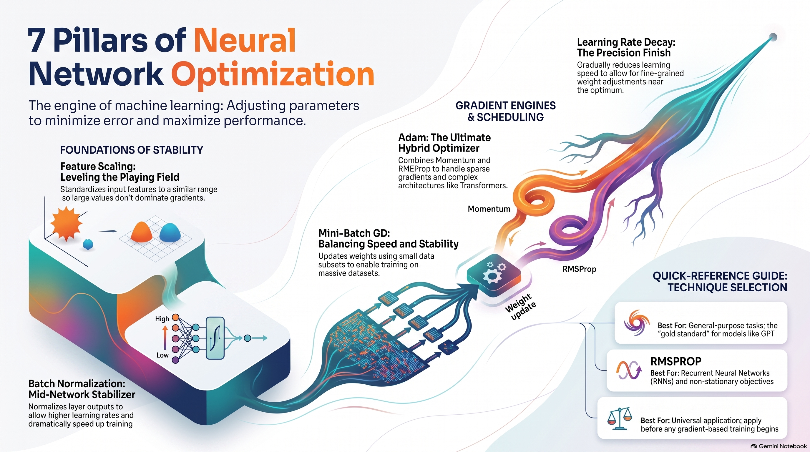

# ⚡ Seven Essential Pillars of Neural Network Optimization

To train a neural network, choosing its structure isn't enough; you need **optimization** — the engine that tweaks the model's internal parameters to minimize mistakes and maximize its predictive performance.

Here are seven essential techniques used to make AI models learn quickly and accurately, simplified:

---

### 1. Feature Scaling *(Leveling the Playing Field)*

**What it is:**  
Making sure all your input data numbers are in a similar range, like between 0 and 1.

**Why it matters:**  
If you feed a computer one feature with huge numbers (like income in dollars) and another with tiny numbers (like height in meters), the huge numbers will dominate the model's math. Scaling puts everything on a level playing field so the model trains much faster without "zig-zagging" its way to the correct answers.

---

### 2. Batch Normalization *(Mid-Network Readjustments)*

**What it is:**  
Pausing between the layers inside the neural network to normalize the data before passing it to the next step.

**Why it matters:**  
As a network learns, the data drifting through its layers can fluctuate wildly. Keeping these layer inputs stable acts like a stabilizer, allowing the model to train dramatically faster using higher learning speeds.

---

### 3. Mini-Batch Gradient Descent *(Taking Smart Steps)*

**What it is:**  
Updating the model's settings using a small group (a "mini-batch") of data at a time, instead of looking at the entire dataset at once or just one single item at a time.

**Why it matters:**  
Processing millions of items at once is too slow and heavy, but looking at just one is too chaotic. Mini-batches (often in sizes like 32 or 64) perfectly balance speed and stability, making it possible to train on massive datasets.

---

### 4. Gradient Descent with Momentum *(The Rolling Ball)*

**What it is:**  
Adding a fraction of the model's previous movement to its current update, giving it "inertia".

**Why it matters:**  
Imagine a ball rolling down a bumpy hill. The accumulated velocity helps push the ball right through shallow local dips and flat spots where it might otherwise get stuck, speeding up its path to the bottom.

---

### 5. RMSProp *(Individual Speed Limits)*

**What it is:**  
An adaptive learning method that gives every single setting in the network its own customized learning speed based on how wildly its recent changes have been bouncing.

**Why it matters:**  
It keeps the training process stable by preventing learning rates from oscillating wildly. It is especially powerful for complex, shifting data like language and sequences.

---

### 6. Adam *(The Ultimate Hybrid)*

**What it is:**  
An optimizer that combines the "rolling ball" momentum trick with RMSProp's customized learning speeds.

**Why it matters:**  
Because it combines the best of both worlds, it is the ultimate "out-of-the-box" choice that works incredibly well on massive models (like the Transformers powering GPT) without needing a ton of manual tuning.

---

### 7. Learning Rate Decay *(Slowing Down at the Finish Line)*

**What it is:**  
Starting with a high learning speed (learning rate) and gradually slowing it down as training progresses.

**Why it matters:**  
Early on, you want to move quickly to explore and learn big concepts. As you get closer to perfection, you slow down to make tiny, precise adjustments and avoid overshooting the target.

---

## 📋 Quick-Reference Guide – Technique Selection

| Technique | Best For |
|-----------|----------|
| **Adam** | General-purpose tasks; the “gold standard” for models like GPT |
| **RMSProp** | Recurrent Neural Networks (RNNs) and non‑stationary objectives |
| **Batch Normalization** | Mid‑network stabilizer; allows higher learning rates and faster training |
| **Feature Scaling** | Universal application; apply before any gradient‑based training begins |
