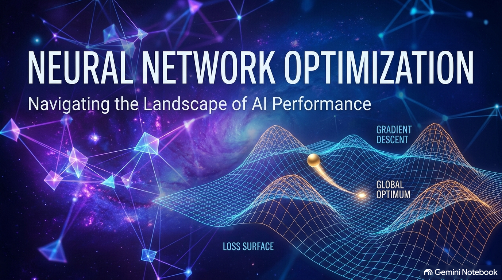

# The Seven Pillars of Neural Network Optimization

Training a neural network is not just about choosing an architecture. Optimization is the engine of machine learning; it is the process of adjusting a model‘s internal parameters to minimize error and maximize predictive performance [1]. Below, I break down the mechanics, pros, and cons of seven essential optimization techniques that form the backbone of modern deep learning, fully adjusted with rigorous math and guidelines.

---

## 1. Feature Scaling (also known as Normalization)

**Feature Scaling**, which is **also known as Normalization**, is the fundamental data preprocessing step of standardizing or normalizing input features to a similar range [1, 17]. 

Think of it like this: if you are comparing heights (ranging from 1 to 2 meters) and incomes (ranging from $20,000 to $200,000), the income feature will dominate the loss function simply because its numerical values are vastly larger [2, 3]. Consequently, features on larger scales can dominate the gradient updates, causing the model to overemphasize them and leading to highly inefficient training [2]. Feature scaling puts all features on the same playing field, ensuring balanced gradient steps [2].

### How It Works: Four Essential Methods

To normalize your data, you can use several distinct methods depending on your distribution:

1. **Rescaling / Min-Max Normalization** [18]
   This method shifts and scales the data so that all values fall within a bounded range, typically $[0, 1]$ [1].
   $$x' = \frac{x - \min(x)}{\max(x) - \min(x)}$$

2. **Standardization / Z-score Normalization** [1, 18]
   This method centers the data to have a mean of 0 ($\mu = 0$) and a standard deviation of 1 ($\sigma = 1$). This is highly useful for algorithms that assume normally distributed data [1].
   $$x' = \frac{x - \mu}{\sigma}$$

3. **Mean Normalization** [18]
   This method scales the data while centering it around a mean of 0, mapping the features into a range between -1 and 1.
   $$x' = \frac{x - \text{avg}(x)}{\max(x) - \min(x)}$$

4. **Unit Length / Unit Vector Normalization** [18]
   This method scales the feature vector to have a length of 1 using either the Euclidean norm ($L_2$ norm) or the Manhattan norm ($L_1$ norm). This is particularly useful in text classification and clustering.
   $$x' = \frac{x}{\|x\|_2} \quad \text{or} \quad x' = \frac{x}{\|x\|_1}$$

### Pros & Cons of Feature Scaling

*   **Pros:**
    *   **Speeds up gradient descent:** Prevents the optimization path from oscillating inefficiently, eliminating the need for gradient descent to "zig-zag" across uneven scales [2, 18].
    *   **Prevents Feature Dominance:** Ensures that features on larger scales do not dominate the loss function, allowing the model to learn from all variables equally [2].
    *   **Model Necessity:** **Some machine learning models don't work if the data is not normalized** [18] (for instance, distance-based models like KNN and SVM, or gradient-based neural networks).
*   **Cons:**
    *   **Computational Overhead:** Can be computationally expensive when processing very large datasets [3].
    *   **Requires Recalculation:** Needs to be recalculated whenever the data distribution changes [3].
    *   **Susceptible to Outliers:** Min-max normalization is particularly vulnerable to outliers since extreme values will compress normal values into a very tight range [3].

> **Crucial Note:** **Not all machine learning algorithms require Feature Scaling.** [18] For example, tree-based models (such as Decision Trees, Random Forests, and Gradient Boosting) are scale-invariant because they split nodes based on threshold rules, completely ignoring the relative magnitude between different features.

### Example:
In a dataset with features like age (0–100), income (20,000–200,000), and number of children (0–10), standardization transforms each feature to have mean 0 and standard deviation 1. Thus, no single feature dominates the gradient updates, preventing the optimization algorithm from going off-track [3].

---

## 2. Batch Normalization

While feature scaling normalizes inputs at the very beginning, **Batch Normalization (Batch Norm)** normalizes the activations within the network during training [3]. It addresses the *internal covariate shift* problem—the phenomenon where the distribution of network activations changes across layers due to changes in network parameters during training [3].

### How It Works:
Batch Normalization **standardizes (using Z-score normalization) the pre-activated output of a hidden layer** for each mini-batch [3, 19]. Because you do not always want a strict mean of 0 and unit variance (which might limit the representational power of non-linear activations), Batch Norm introduces two learnable parameters: **$\gamma$ (gamma)** for scaling and **$\beta$ (beta)** for shifting [19].
$$z_{\text{norm}} = \frac{z - \mu_{\text{batch}}}{\sqrt{\sigma_{\text{batch}}^2 + \epsilon}}$$
$$z_{\text{BN}} = \gamma \cdot z_{\text{norm}} + \beta$$
Here, **$\gamma$ and $\beta$ are parameters that are learned by the network** during training, allowing it to revert the normalization if that is optimal for minimizing the loss [19].

### Pros & Cons of Batch Normalization

*   **Pros:**
    *   **Allows for higher learning rates:** Dramatically speeds up training by making the network less sensitive to poor initialization [4, 20].
    *   **Can build deeper networks with shorter training time:** By maintaining activation stability, it enables very deep architectures to converge rapidly [20].
    *   **Works well with other optimization methods:** Integrates perfectly with methods like SGD with momentum, RMSprop, and Adam [19].
    *   **Is stable if the batch size is large:** Relies on stable batch statistics to estimate the true population mean and variance [20].
    *   **Can add some regularizing effects:** Introduces slight stochastic noise into the layer activations (due to mini-batch statistics), potentially reducing the need for dropout [4, 20].
*   **Cons:**
    *   **Not good for online learning (small batches):** When batch sizes are extremely small, mini-batch statistics become highly volatile and unreliable [5, 20].
    *   **Not good for RNNs / LSTMs:** Since sequence lengths vary and recurrent weights are shared across time steps, standard Batch Norm does not translate well to sequential models [20].
    *   **Different calculations between training and testing:** **You have to use a different calculation between training and testing.** [20] During training, mean and variance are computed per mini-batch. During testing (inference), the model must use a running, exponentially weighted average of mean and variance accumulated during training [20].

### Example:
In a Convolutional Neural Network (CNN) trained on the MNIST dataset, applying batch normalization after each convolutional layer allows you to use a learning rate of 0.01 instead of 0.001, cutting training time by half while achieving the same target accuracy [5].

---

## 3. Mini-Batch Gradient Descent (often referred to as SGD)

**Mini-Batch Gradient Descent**, which is **often referred to as Stochastic Gradient Descent (SGD)** in deep learning frameworks [20], is the standard engine for training neural networks.

### How It Works:
Instead of updating parameters using the entire dataset (Batch GD) or a single sample (pure SGD), you **split the training data into smaller (mini) batches with a set batch size and perform back-propagation on each mini-batch** [5, 21]. 

*   **Epoch:** Completing back-propagation on all mini-batches exactly once constitutes an **epoch** [21].
*   **Data Randomization:** To break correlation between updates, standard implementations **randomize (shuffle) the training data at the beginning of each epoch** [21].

The choice of mini-batch size embodies the classic bias-variance trade-off [5]: larger batches yield stable but computationally expensive gradients, whereas smaller batches introduce stochastic noise that can act as a regularizer.

### Pros & Cons of Mini-Batch Gradient Descent

*   **Pros:**
    *   **Speeds up gradient descent:** More memory-efficient than full-batch gradient descent and leverages hardware acceleration via vectorization [6, 21].
    *   **Has a more stable convergence:** Yields smoother updates than single-sample SGD while retaining beneficial stochastic noise that helps escape local minima [6, 21].
*   **Cons:**
    *   **Difficult to choose an appropriate batch size:** Finding the optimal batch size (typically powers of two, such as 32, 64, 128, 256, 512) requires empirical tuning [6, 21].
    *   **Hard to deal with saddle points:** Flat regions can stall SGD completely because the gradients drop to zero [22].
    *   **Hard to deal with ravines and local optima:** Progress can stall in sub-optimal local basins, or oscillate endlessly across sharp ravines [22].

### Core Definitions: Saddle Points, Ravines, and Local Optima

To understand the shortcomings of standard gradient descent, we must define three key topological challenges on the loss surface:

1.  **Local Optima:** A point in the parameter space where the loss is lower than in the immediately surrounding area, but not the absolute lowest (which is the global optimum) [22]. The optimizer can easily become trapped here if the gradient drops to zero [22].
2.  **Saddle Points:** A point on the loss surface where the gradient is zero, but the function curves upward in some directions and downward in others [22]. Standard gradient descent often slows down or stalls completely in these flat areas because the driving forces vanish [22].
3.  **Ravines:** Long, narrow valleys where the surface curves much more steeply in one direction than another [22]. Standard SGD often bounces back and forth across the steep sides rather than making progress along the shallow floor of the valley toward the optimum [22].

### Example:
If you are training on 1 million images, using a mini-batch size of 64 means that each parameter update processes only 64 images. This makes updates 15,625 times faster than waiting to process the entire dataset at once [7].

---

## 4. Gradient Descent with Momentum

To address the limitations of standard gradient descent in navigating ravines and flat regions, we introduce **Momentum**, which adds a physical sense of "inertia" to our optimization path [7].

### How It Works:
Momentum accelerates progress by accumulating a moving average of past gradients and adding a fraction of the previous update to the current one [7].
$$v_t = \beta \cdot v_{t-1} + \alpha \cdot \text{Grad}(w)$$
$$w = w - v_t$$
Here:
*   $v_t$ is the velocity vector accumulated over time [7].
*   $\beta$ is the momentum hyperparameter (usually set to 0.9), controlling how much past velocity to retain [7].
*   $\alpha$ is the learning rate [7].
*   $\text{Grad}(w)$ is the gradient of the loss with respect to the weights [7].

### Pros & Cons of Momentum

*   **Pros:**
    *   **Keeps update vector in the same general direction $\rightarrow$ faster convergence:** Accumulating velocity along consistent directions speeds up the journey down the loss surface [8, 22].
    *   **Less oscillation around ravines and local optima:** Dampens the wild "ping-ponging" oscillations across steep ravine walls while reinforcing progress along the shallow valley floor [8, 22].
*   **Cons:**
    *   **Can cause the model to pass the optimum:** Due to the physical inertia, the optimizer can overshoot the optimal target and oscillate around the minimum before settling down [8, 23].
    *   **Learning Rate Scaling:** **You have to remember to scale down the learning rate by a factor of $(1 - \beta)$.** [23] Because the effective step size is amplified by approximately $1 / (1 - \beta)$ when gradients are consistent, neglecting to scale down the learning rate $\alpha$ can lead to unstable training or catastrophic divergence.

### Example:
During deep network training on ImageNet, momentum allows the optimizer to maintain velocity through long flat ravines (where gradients are consistent but tiny) while damping oscillations in high-curvature directions, cutting convergence time by 30% to 50% [8].

---

## 5. RMSProp (Root Mean Squared Propagation)

Developed by Geoffrey Hinton, **RMSProp** is an adaptive learning rate method designed to normalize gradients on a per-parameter basis [9].

### How It Works:
Instead of using a single learning rate for all parameters, RMSProp **divides the gradient by the square root of the moving (propagated) average (mean) of the square of the gradient** [9, 23]. This scales the learning rates of parameters inversely proportional to their historical gradient magnitudes [9].
$$s_t = \beta \cdot s_{t-1} + (1 - \beta) \cdot [\text{Grad}(w)]^2$$
$$w_t = w_{t-1} - \frac{\alpha \cdot \text{Grad}(w)}{\sqrt{s_t} + \epsilon}$$
Where:
*   $s_t$ is the running exponentially weighted average of squared gradients [9].
*   $\beta$ is the decay rate (typically 0.9) [9].
*   $\alpha$ is the base learning rate [9].
*   **$\epsilon$ (epsilon) is a small constant (typically $1e-8$) added to the denominator to avoid division by zero.** [9, 24]

### Pros & Cons of RMSProp

*   **Pros:**
    *   **Speeds up gradient descent:** Dynamically balances the step sizes across different coordinates [24].
    *   **Helps to deal with ravines and saddle points:** By scaling down aggressive updates in steep directions and scaling up small updates in flat directions, it navigates complex topologies smoothly [24].
    *   **Can use a larger learning rate:** Normalizing gradients prevents exploding gradients, allowing for more aggressive learning rates [24].
    *   **Adapts to non-stationary objectives:** Works exceptionally well for sequential tasks such as Recurrent Neural Networks (RNNs) and Reinforcement Learning [9].
*   **Cons:**
    *   **Requires Tuning:** The decay rate hyperparameter $\beta$ requires careful tuning [10].
    *   **Can Converge Slowly:** In some regimes, step sizes can decay too aggressively, slowing progress down near the end of training [10].

### Example:
When training an LSTM for language modeling, RMSProp’s per-parameter adaptive learning rates manage the varying gradient magnitudes across time steps, preventing the vanishing/exploding gradient problems and yielding much more stable convergence than standard SGD [10].

---

## 6. Adam Optimization (Adaptive Moment Estimation)

**Adam** is arguably the most popular optimizer in modern deep learning, combining the strengths of both Momentum and RMSProp [11, 24].

### How It Works:
Adam is a **combination of RMSprop and SGD with momentum**. It tracks both the first moment (the mean of the gradients, like momentum) and the second moment (the uncentered variance of the gradients, like RMSProp) [11, 24].
$$m_t = \beta_1 \cdot m_{t-1} + (1 - \beta_1) \cdot \text{Grad}(w)$$
$$v_t = \beta_2 \cdot v_{t-1} + (1 - \beta_2) \cdot [\text{Grad}(w)]^2$$

Because $m_t$ and $v_t$ are typically initialized as vectors of zeros, they are biased toward zero, particularly during the first few time steps. To correct this, Adam applies bias corrections to compute normalized moments [11]:
$$m_t^{\text{norm}} = \frac{m_t}{1 - \beta_1^t}$$
$$v_t^{\text{norm}} = \frac{v_t}{1 - \beta_2^t}$$

Using these corrected estimates, Adam updates the weights [11]:
$$w_t = w_{t-1} - \frac{\alpha \cdot m_t^{\text{norm}}}{\sqrt{v_t^{\text{norm}}} + \epsilon}$$
Where:
*   $\beta_1$ (typically 0.9) and $\beta_2$ (typically 0.999) are the decay rates for the moments [7, 9].
*   **$\epsilon$ (epsilon) is a small constant (such as $1e-8$) added to the denominator to avoid division by zero.** [24]

### Pros & Cons of Adam

*   **Pros:**
    *   **Speeds up gradient descent:** Combines the direction-smoothing of momentum with the scale-adaptivity of RMSProp [25].
    *   **Good at navigating ravines and saddle points:** Escapes flat regions quickly while stabilizing updates along steep channels [25].
    *   **Good with sparse gradients:** Performs exceptionally well on problems with sparse or highly noisy gradients, which are common in NLP tasks [12, 25].
    *   **Good for online learning:** Adapts rapidly as new, non-stationary data streams in [25].
*   **Cons:**
    *   **Extra Memory:** Storing two separate moments per parameter roughly triples the memory footprint of the optimizer compared to standard SGD [12].
    *   **Suboptimal Generalization:** **Adam does not always achieve the optimal results relative to other optimization methods.** [25] Some studies show a generalization gap on specific image classification or translation tasks, where tuned SGD with momentum can find flatter, more generalizable minima [12].

### Example:
Adam is the undisputed go-to optimizer for training Transformer models like BERT and GPT [13]. Its adaptive, per-parameter learning rates handle the radically different gradient magnitudes across attention heads and multi-layered architectures [13].

---

## 7. Learning Rate Decay

No matter which optimizer you choose, starting with a large learning rate helps make rapid progress, but keeping it large can cause the model to bounce endlessly around the optimum. **Learning Rate Decay** is the process of **gradually reducing the learning rate as training progresses** [13, 25].

### How It Works:
Learning rate decay **slows down the learning rate as it approaches the optimum so that it does not overshoot.** [26] 

There are three common mathematical methods to decay the learning rate over time:

1.  **Exponential Decay** [26]
    The learning rate decreases exponentially at each time step $t$ or epoch [26].
    $$\text{lr} = \text{lr}_0 \cdot e^{-d \cdot t}$$
    *(where $d$ is the decay rate and $\text{lr}_0$ is the initial learning rate)* [26]

2.  **Time-based Decay** [26]
    The learning rate decreases based on a linear factor of time $t$ [26].
    $$\text{lr} = \frac{\text{lr}_0}{1 + d \cdot t}$$ [26]

3.  **Step Decay** [26]
    The learning rate drops by a specific factor $d$ at fixed, pre-defined intervals (epochs) [26].
    $$\text{lr} = \text{lr}_0 \cdot d^{\lfloor \text{epoch} / \text{epoch\_drops} \rfloor}$$
    *(where `epoch_drops` represents how often the rate should drop)* [26]

### Pros & Cons of Learning Rate Decay

*   **Pros:**
    *   **Faster initial progress:** High early rates allow rapid traversal of flat regions and escape from saddle points or poor local minima [14].
    *   **Better final accuracy:** Lower rates later allow for fine-grained weight adjustments near the global optimum [14].
*   **Cons:**
    *   **Too many hyperparameters:** Determining the decay rate, decay steps, and schedule type requires troublesome trial-and-error [14, 27].
    *   **Hard to know ahead of training:** It is extremely difficult to anticipate when the learning rate should drop before the training run begins [27].
    *   **Non-Adaptive:** Because the hyperparameters governing the schedule are static, the decay is entirely blind to the actual training dynamics [27].
    *   **Better Alternatives:** In many complex scenarios, **it is often better to use adaptive learning rate optimization methods (like RMSprop or Adam)** which automatically adjust learning rates on the fly rather than relying on a rigid, handcrafted decay schedule [27].

### Example:
When training a ResNet-50 on ImageNet, starting with an initial learning rate of 0.1 and dividing it by 10 every 30 epochs (Step Decay) yields a significantly higher final accuracy than keeping the learning rate fixed throughout the entire training process [15].

---

## Summary Decision Guide

| Technique | Best For | Key Formulation / Equation |
| :--- | :--- | :--- |
| **Feature Scaling** | **Always** apply before gradient training [15]. | $x' = \frac{x - \mu}{\sigma}$ (Standardization) [18] |
| **Batch Normalization** | Deep CNNs and dense networks; allows higher learning rates [15]. | $z_{\text{BN}} = \gamma \cdot z_{\text{norm}} + \beta$ [19] |
| **Mini-Batch GD** | **Always** — the standard baseline for deep learning [15]. | Split data into batches; backprop per batch [21]. |
| **Momentum** | Smooths updates and speeds convergence [15]. | $v_t = \beta \cdot v_{t-1} + \alpha \cdot \text{Grad}(w)$ [22] |
| **RMSProp** | RNNs, reinforcement learning, non-stationary problems [15]. | $s_t = \beta \cdot s_{t-1} + (1-\beta)\text{Grad}(w)^2$ [23] |
| **Adam** | General-purpose tasks; outstanding default choice [15]. | Dual moments $m_t$ (momentum) & $v_t$ (RMSprop) [11, 24]. |
| **Learning Rate Decay** | Fine-tuning any optimizer for maximum accuracy [15]. | $\text{lr} = \text{lr}_0 \cdot e^{-d \cdot t}$ (Exponential) [26] |

---

*This post was inspired by the optimization techniques covered in the Holberton School Machine Learning curriculum [15]. The code examples throughout this series demonstrate implementing each technique from scratch in NumPy and TensorFlow [15].*
